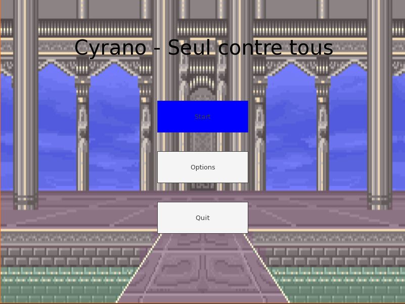
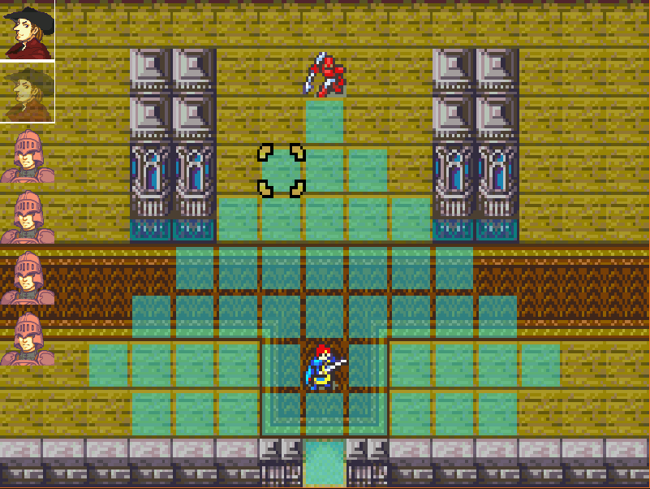

# Cyrano - Seul contre tous

Student Project in C++ using SFML, tmxlite, nlohmann::json and TGUI. 
Imposed Theme : "Cyrano de Bergerac"

This game is a bare-bones recreation of GBA Fire emblem game in C++ with a "Cyrano de Bergerac" skin. However, the game takes a different approach when it comes to turn phase : instead of dividing it into player and enemy phase, each character has their own turn and each action cost time.

# Description

Play as Cyrano from the play of Edmond Rostand and face waves of enemies as you stall for time for Roxane. 

Outwit your foes with your strategic skills and taunt them with panache (TBA) to gain the upper hand !





# How to play

Controls : 

- Arrow keys to move
- W : Confirm
- X : Cancel
- C : Menu

Controls will be changeable in the Options (TBA)

Confirm on a character to see his movement range. If you clicked your character, you can confirm within range to move it.

Confirm twice to see his attack range. If you clicked your character, you can confirm within range to attack.

Cancel before choosing another one.

Hit the menu button to see the stats of a previously clicked character. (TBA)

# How to run

```
git clone git@github.com:Ezloz/Cyrano_seul_contre_tous.git

cd Cyrano_seul_contre_tous

cmake -B build -G Ninja

cmake --build build

./build/src/main/main
```

# Systems Requirements

Whatever shows up when running ```cmake -B build -G Ninja```

Disk Size : 1 GB (TGUI is the culprit, taking 500 Mb. Could be way less if we knew how to use CMake properly.)


Tested on Linux and Windows

# Credits

Contributors :
- Ezloz
- Kaou

Code :
- https://www.sfml-dev.org/fr/
- https://tgui.eu/
- https://github.com/fallahn/tmxlite
- https://github.com/nlohmann/json

Assets:
- Fire emblem : The Sacred Stones
- Fire emblem : The Binding Blade

